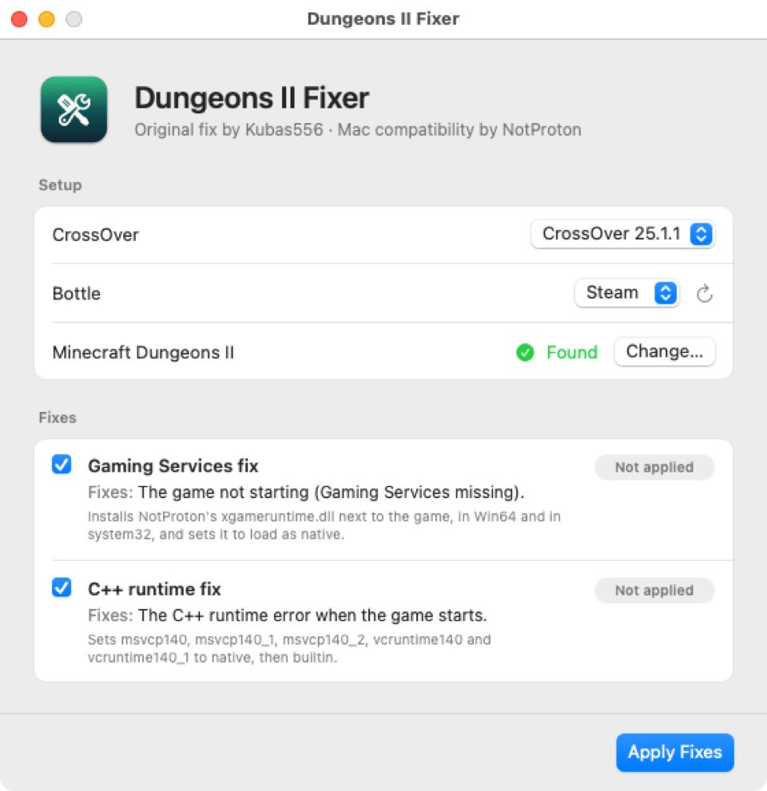

# Dungeons II Fixer

Get Minecraft Dungeons II running on your Mac with CrossOver, in one click.

**[Download the latest version](../../releases/latest)**

Works on macOS 13 or later, on Apple Silicon and Intel Macs.

## Before you start

You need [CrossOver](https://www.codeweavers.com/crossover), with Steam and Minecraft Dungeons II installed in a bottle.

## How to use it

1. Quit Steam. Right-click its icon in the Dock and choose **Quit**.
2. Open the DMG and drag **Dungeons II Fixer** to Applications, then open it.
3. Choose your CrossOver version and the bottle Steam is in.
4. Click **Apply Fixes**.
5. Open Steam in CrossOver and play.

A Microsoft sign-in window may pop up when the game starts. You don't need it to play on Steam.

To undo everything, open the app and click **Remove Fixes**.

## What it fixes

- **Gaming Services fix.** The game won't start because Microsoft Gaming Services is missing. This installs NotProton's `xgameruntime.dll` in the three places the game looks for it.
- **C++ runtime fix.** Stops the C++ runtime error at launch. It sets the same DLL overrides you would add by hand in Wine Configuration.

## Good to know

- Please don't contact CodeWeavers support about a bottle with these fixes applied. Remove the fixes first.
- This app was made with the help of AI and has been tested by real people. Use it at your own risk, especially when signing in to Microsoft or playing online.

## Credits

- **[NotProton](https://github.com/NotProtonNot/Dungeons2_macOS_fix):** Mac compatibility and the `xgameruntime.dll` this app installs.
- **Kubas556:** the original Minecraft Dungeons II fix for Linux, which NotProton's work is based on.
- **[macprotips](https://github.com/macprotips):** the Dungeons II Fixer app.

Not affiliated with Mojang, Microsoft or CodeWeavers. Minecraft is a trademark of Mojang Synergies AB. CrossOver is a trademark of CodeWeavers, Inc.

Building the app yourself? See [BUILDING.md](BUILDING.md).
